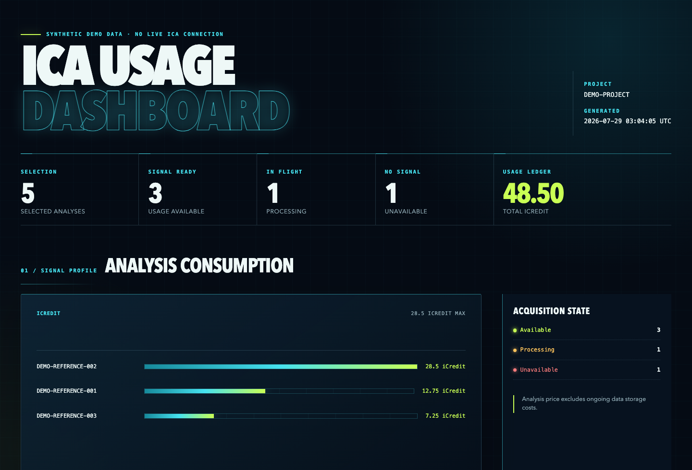
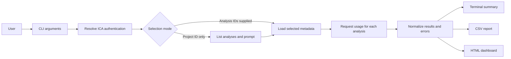

# ICA Usage Dashboard — Public Showcase

> **Synthetic demonstration only.** This repository contains no ICA
> credentials, real project data, or implementation source code. The live demo
> does not connect to ICA or any external service.

## Live demo

[Open the synthetic ICA Usage Dashboard](https://wf4006hufman.github.io/ICA_usage_dashboard_showcase/)

## Dashboard preview

Select the preview to open the interactive dashboard.

## Why this exists

Looking up ICA credit usage one analysis at a time requires repetitive CLI and
API work. The demonstrated workflow collects multiple analysis results in one
run and turns them into terminal, CSV, or standalone HTML reports that are
easier to review and share.

## Who this is for

- Bioinformatics support engineers investigating project consumption
- ICA project and pipeline operators checking analysis-level usage
- Project leads reviewing analysis consumption and reporting
- Automation users generating non-interactive usage reports

## How it works

## What the demo shows

The live page is a standalone HTML artifact with synthetic records. It
demonstrates summary metrics, per-analysis credit visualization, status
handling, filtering, and sortable table columns.

## Data safety

- All project, analysis, reference, pipeline, date, and usage values are
  synthetic.
- The page contains no API key, cookie, token, user email, or real identifier.
- The page makes no network request and loads no third-party resource.
- This showcase does not include the Python CLI or ICA retrieval implementation.
